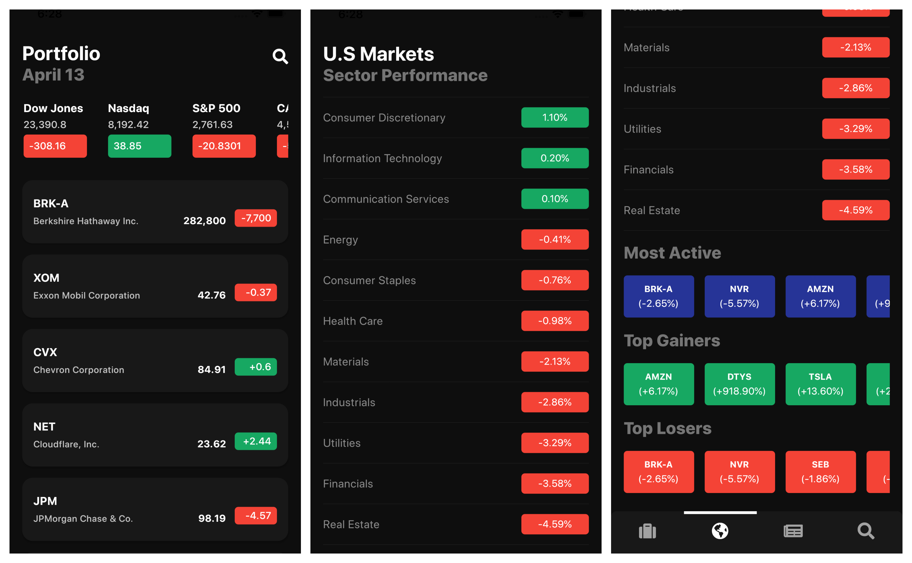
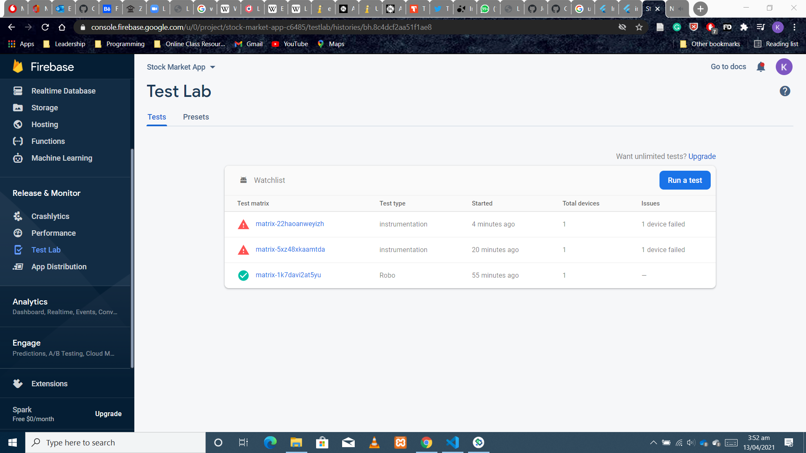

# Stonks - Mobile
This is a simple app that helps users track their favorite stocks. This is not a real time watchlist as calls are made daily. We use a lot of free API's that limits our functionalities but all the same it is a great app and this team is proud to present it

This is a high level of the main screen

## Test Results
Here are images of app test in firebase test lab.

Results of Accessibility Tests

Results of Instance Tests

Results of Performance Tests

More tests results are in [images](https://github.com/KwekuYamoah/Crypto-App/blob/01b6305a9ed3c0acdb3cb54822c4ad83caf8cabc/Stock-Market-App/README.md#L30)

## Functionalities
- Users can see stocks.
- Users can save stocks.
- Users can delete stocks.
- Users can search for stocks.
- Users can get detailed information about a single stocks.
- Users can see news about their stocks - Powered by NewsAPI.org.
- Users can see sector performance.
- Users can see market movers, winners, and losers.
- Users can see market indexes.

## Coming soon
- Users can delete all of their stocks.
- Users can switch theme.
